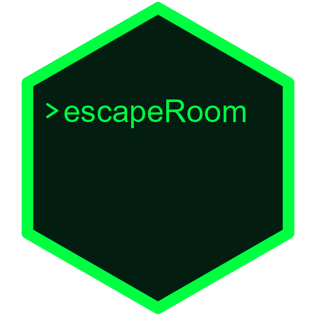
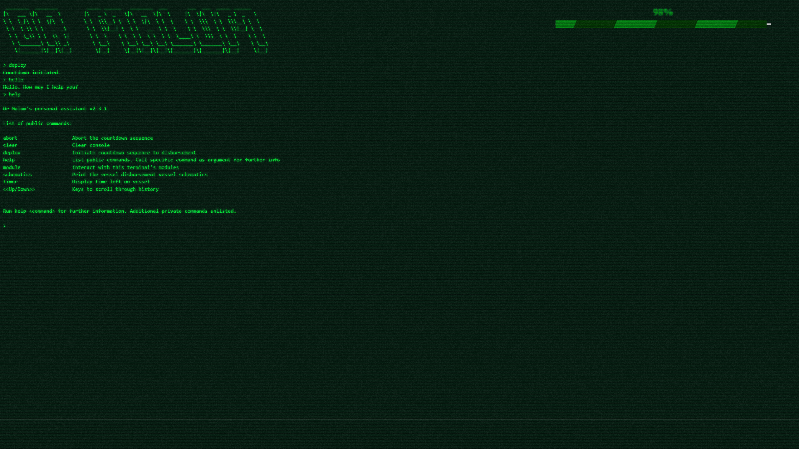

# escapeRoom 


**A customisable escape room built with an R Shiny backend**

>Welcome to the secret laboratory of the evil scientist Dr Malum! They have left an odour disbursement vessel somewhere in [city] that will stink up the streets for weeks. You, our elite investigative taskforce, are our only hope to foil their plan. You must navigate their laboratory filled with puzzles and challenges that will test your skills and knowledge. You must solve each puzzle to unlock the necessary clues to disarm the vessel. 

**No good? How about:**

>Welcome to the secret lair of computer scientist Dr Dren! They have developed an electromagnetic pulse (EMP) device that can take out [your company's or favourite service's] entire server stack in one strike, and it's up to you to stop them before they wreak havoc...

`escapeRoom` is a fully customisable, open-source escape room experience built on an R Shiny app. You may keep the default settings and puzzles for a quick set-up or go all out customising the experience to your team's skillset with a relatable theme. While it is a Shiny app and the example puzzles included are coding challenges, this can be run by R novices and may involve any type of puzzles/challenges. 

`escapeRoom` is a great team building activity where the group must work together in a non-competitive environment and help each other find the solutions to the puzzles. The best part: there is no cost! The activity is centred around a custom computer terminal that the evil genius has developed which is the only way to interact with the device to disarm it. Someone (you) will need to act as the evil genius to start the terminal, select the puzzles and guide the activity forward if necessary. Don't worry, it is just as fun (if not more so) to play this part. 

The activity is designed to be run in-person but can be run for a remote team (see the [wiki](https://github.com/PeterM74/escapeRoom/wiki)).

Below is a screenshot of the default terminal's appearance after some commands have been entered:



## Getting started
Ensure you have [R](https://www.r-project.org/) installed (any operating system) and install the following packages:

```
install.packages(c("tidyverse", "shiny", "shinyjs"))
```

You are now all set! To learn more about how to set up the escape room and how it functions, please read the [wiki](https://github.com/PeterM74/escapeRoom/wiki).

## Contributing and getting help
If you encounter a bug or crash, please file an [issue](https://github.com/PeterM74/escapeRoom/issues) with a reproducible example if possible. You may also submit requests to improve the experience through the `enhancements` tag.

I gratefully welcome any contributors to the project. Let me know if you would like to contribute!

## Feedback
I released this project so that others may also enjoy running the activity. I would love to hear your feedback (positive or negative) to know that other teams have tried it out and hopefully found it enjoyable. Criticism is also gratefully accepted. To leave feedback, complete this [Google Form](https://docs.google.com/forms/d/1RJmuKExzNSEbYORtJFS6aJUPR7u0GAeGU8AnAqVeHgk/).

If you enjoyed `escapeRoom`, please leave a star! :star:
